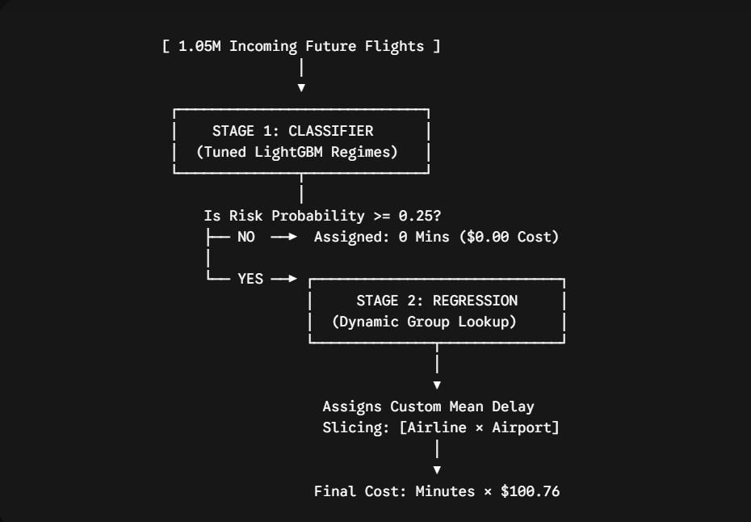
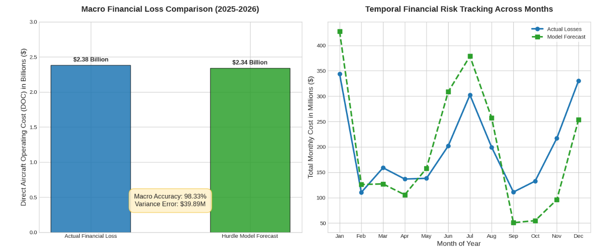

# ✈️ Flight Delay Prediction & Cost Forecasting

A machine learning pipeline that predicts U.S. flight delays and estimates their financial impact, built by merging real-world airline performance and weather data from 2019 to 2026.

---

## 🧠 What It Does

1. **Predicts whether a flight will be delayed** using a tuned LightGBM classifier trained on ~4.9 million rows of flight records enriched with local weather conditions.
2. **Forecasts the cost of delays** using a two-stage regression pipeline that translates predicted delay minutes into dollar figures.

---

## 📊 Data Sources

| Dataset | Source | Coverage |
|---|---|---|
| U.S. Airline On-Time Performance | [BTS via Kaggle](https://www.kaggle.com/datasets/kamalalqedra/bts-ontime-performance-2019-present-csv) | 2019 – 2026 |
| ASOS Weather Observations | [Kaggle](https://www.kaggle.com/datasets/sehamhakimothman/asos-weather-data-2019-2026) | 2019 – 2026 |

---

## How the data sources are merged?
#### 1.Filtered for Commercial Airports Only
- keep only 10 major commercial airports which exist in both Airline data and weather data, and delete the 50 remaining.
- Why: Commercial airplanes (like the ones in airline dataset) only fly between large airports; they cannot land on tiny hobby farm strips. Dropping them shrank the file by 90% (Million rows to hundred thousands) instead of having 90% of NaN not match.
#### 2.Do a Double merging to the shared 10 commercial Airports
- meaning each weather feature will be 2 one for Origin Airport and the second one for the Dest Airport

---

## 🔍 Features

### Classification

# BTS_Airline data
- Quarter
- Month
- Day of Month
- Day of Week
- Flight Date
- Reporting Airline
- Origin
- Destination
- CRS Dep time
- Dep-Delay
- CRS Arrival time
- Arr-delay
- CRS Elapsed Time
- Flights (number of daily flights): COUNT

# IOWA_ Weather data
- tmpf_origin
- sknt_origin
- p01i_origin
- vsby_origin
- skyc1_origin
- skyl1_origin
- tmpf_dest
- sknt_dest
- p01i_dest
- vsby_dest
- skyc1_dest
- skyl1_dest

### Regression

# BTS_Airline data
- Quarter
- Month
- Day of Month
- Day of Week
- Flight Date
- Reporting Airline
- Origin
- Destination
- CRS Dep time
- Dep-Delay
- CRS Arrival time
- Arr-delay
- CRS Elapsed Time
- Flights (number of daily flights): COUNT
- Distance
- CRS Elapsed time
- Carrier delay
- Weather delay
- NAS delay
- Late aircraft delay

# IOWA_ Weather data
- tmpf_origin
- sknt_origin
- p01i_origin
- vsby_origin
- skyc1_origin
- skyl1_origin
- tmpf_dest
- sknt_dest
- p01i_dest
- vsby_dest
- skyc1_dest
- skyl1_dest

---

## 📈 Model Performance

| Metric | Value |
|---|---|
| ROC-AUC | 0.7128 |
| Overall Accuracy | 71% |
| On-Time F1-Score | 0.80 |
| Delayed F1-Score | 0.47 |
| Cost Forecast Error | ~$40M on $2.38B actual |

> The lower F1 for delayed flights reflects natural class imbalance — delayed flights are the minority class (~25% of records).

Regression Hurdle model results:

---
## 🛠️ Tech Stack

- **Python** — pandas, scikit-learn, LightGBM
- **Data** — BTS On-Time Performance + ASOS Weather
- **Modeling** — Classification (delay/no delay) + Regression (delay cost)
